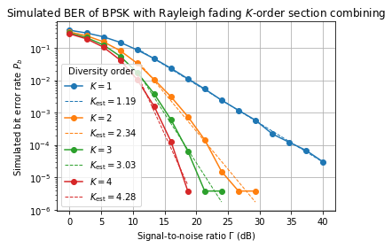

```python
%run -i ./python/bpsk_rayleigh_3path.py
```

# BER Simulation for BPSK for 3-Path Rayleigh Fading under Section, Equal Gain, and Max Ratio Combining Methods


```python
N       = 2**18                 # Number of symbols
K       = 3                     # Number of diversity branches
Ga_l    = np.logspace(-.5,2,16) # Simulation SNR values
FIGNAME = "diversity_combining_methods.png"

fig, axs = plt.subplots()
axs.set_title(r"Simulated BER of BPSK under Rayligh fading and diversity order $K = {}$".format(K))
axs.set_xlabel(r"Signal-to-noise ratio $\Gamma$ (dB)")
axs.set_ylabel(r"Simulated bit error rate $P_b$")
axs.set_yscale("log")

for combiner in COMBINERS:
    Pe_l = BPSKRayleighDiversityBER(N,K,Ga_l,combiner)
    axs.plot(20*np.log10(Ga_l),Pe_l,"o-",label=combiner)

axs.legend(title="Combining method")
fig.tight_layout()
fig.savefig("./plots/{}".format(FIGNAME))
```


# BER Simulation for BPSK for K-Path Rayleigh Fading under Section Combining Method


```python
N        = 2**18                 # number of symbols
Ga_l     = np.logspace(0,2,16)   # SNR values
COMBINER = "section"             # Possible values: {"section", "equal gain", "max ratio"}
FIGNAME  = "diversity_order.png"

fig, axs = plt.subplots()
axs.set_title(r"Simulated BER of BPSK with Rayleigh fading $K$-order {} combining".format(COMBINER))
axs.set_xlabel(r"Signal-to-noise ratio $\Gamma$ (dB)")
axs.set_ylabel(r"Simulated bit error rate $P_b$")
axs.set_yscale("log")

for K in [1,2,3,4]:
    Pe_l = BPSKRayleighDiversityBER(N,K,Ga_l,COMBINER)
    axs.plot(20*np.log10(Ga_l),Pe_l,"o-",label=r"$K = {}$".format(K))
    
axs.legend(title = "Diversity order")
fig.tight_layout()
fig.savefig("./plots/{}".format(FIGNAME))
```




This application is used to convert notebook files (*.ipynb) to various other
formats.

WARNING: THE COMMANDLINE INTERFACE MAY CHANGE IN FUTURE RELEASES.

Options
-------

Arguments that take values are actually convenience aliases to full
Configurables, whose aliases are listed on the help line. For more information
on full configurables, see '--help-all'.

--debug
    set log level to logging.DEBUG (maximize logging output)
--generate-config
    generate default config file
-y
    Answer yes to any questions instead of prompting.
--execute
    Execute the notebook prior to export.
--allow-errors
    Continue notebook execution even if one of the cells throws an error and include the error message in the cell output (the default behaviour is to abort conversion). This flag is only relevant if '--execute' was specified, too.
--stdin
    read a single notebook file from stdin. Write the resulting notebook with default basename 'notebook.*'
--stdout
    Write notebook output to stdout instead of files.
--inplace
    Run nbconvert in place, overwriting the existing notebook (only 
    relevant when converting to notebook format)
--clear-output
    Clear output of current file and save in place, 
    overwriting the existing notebook.
--no-prompt
    Exclude input and output prompts from converted document.
--no-input
    Exclude input cells and output prompts from converted document. 
    This mode is ideal for generating code-free reports.
--log-level=<Enum> (Application.log_level)
    Default: 30
    Choices: (0, 10, 20, 30, 40, 50, 'DEBUG', 'INFO', 'WARN', 'ERROR', 'CRITICAL')
    Set the log level by value or name.
--config=<Unicode> (JupyterApp.config_file)
    Default: ''
    Full path of a config file.
--to=<Unicode> (NbConvertApp.export_format)
    Default: 'html'
    The export format to be used, either one of the built-in formats, or a
    dotted object name that represents the import path for an `Exporter` class
--template=<Unicode> (TemplateExporter.template_file)
    Default: ''
    Name of the template file to use
--writer=<DottedObjectName> (NbConvertApp.writer_class)
    Default: 'FilesWriter'
    Writer class used to write the  results of the conversion
--post=<DottedOrNone> (NbConvertApp.postprocessor_class)
    Default: ''
    PostProcessor class used to write the results of the conversion
--output=<Unicode> (NbConvertApp.output_base)
    Default: ''
    overwrite base name use for output files. can only be used when converting
    one notebook at a time.
--output-dir=<Unicode> (FilesWriter.build_directory)
    Default: ''
    Directory to write output(s) to. Defaults to output to the directory of each
    notebook. To recover previous default behaviour (outputting to the current
    working directory) use . as the flag value.
--reveal-prefix=<Unicode> (SlidesExporter.reveal_url_prefix)
    Default: ''
    The URL prefix for reveal.js (version 3.x). This defaults to the reveal CDN,
    but can be any url pointing to a copy  of reveal.js.
    For speaker notes to work, this must be a relative path to a local  copy of
    reveal.js: e.g., "reveal.js".
    If a relative path is given, it must be a subdirectory of the current
    directory (from which the server is run).
    See the usage documentation
    (https://nbconvert.readthedocs.io/en/latest/usage.html#reveal-js-html-
    slideshow) for more details.
--nbformat=<Enum> (NotebookExporter.nbformat_version)
    Default: 4
    Choices: [1, 2, 3, 4]
    The nbformat version to write. Use this to downgrade notebooks.

To see all available configurables, use `--help-all`

Examples
--------

    The simplest way to use nbconvert is
    
    > jupyter nbconvert mynotebook.ipynb
    
    which will convert mynotebook.ipynb to the default format (probably HTML).
    
    You can specify the export format with `--to`.
    Options include ['asciidoc', 'custom', 'html', 'latex', 'markdown', 'notebook', 'pdf', 'python', 'rst', 'script', 'slides']
    
    > jupyter nbconvert --to latex mynotebook.ipynb
    
    Both HTML and LaTeX support multiple output templates. LaTeX includes
    'base', 'article' and 'report'.  HTML includes 'basic' and 'full'. You
    can specify the flavor of the format used.
    
    > jupyter nbconvert --to html --template basic mynotebook.ipynb
    
    You can also pipe the output to stdout, rather than a file
    
    > jupyter nbconvert mynotebook.ipynb --stdout
    
    PDF is generated via latex
    
    > jupyter nbconvert mynotebook.ipynb --to pdf
    
    You can get (and serve) a Reveal.js-powered slideshow
    
    > jupyter nbconvert myslides.ipynb --to slides --post serve
    
    Multiple notebooks can be given at the command line in a couple of 
    different ways:
    
    > jupyter nbconvert notebook*.ipynb
    > jupyter nbconvert notebook1.ipynb notebook2.ipynb
    
    or you can specify the notebooks list in a config file, containing::
    
        c.NbConvertApp.notebooks = ["my_notebook.ipynb"]
    
    > jupyter nbconvert --config mycfg.py

This application is used to convert notebook files (*.ipynb) to various other
formats.

WARNING: THE COMMANDLINE INTERFACE MAY CHANGE IN FUTURE RELEASES.

Options
-------

Arguments that take values are actually convenience aliases to full
Configurables, whose aliases are listed on the help line. For more information
on full configurables, see '--help-all'.

--debug
    set log level to logging.DEBUG (maximize logging output)
--generate-config
    generate default config file
-y
    Answer yes to any questions instead of prompting.
--execute
    Execute the notebook prior to export.
--allow-errors
    Continue notebook execution even if one of the cells throws an error and include the error message in the cell output (the default behaviour is to abort conversion). This flag is only relevant if '--execute' was specified, too.
--stdin
    read a single notebook file from stdin. Write the resulting notebook with default basename 'notebook.*'
--stdout
    Write notebook output to stdout instead of files.
--inplace
    Run nbconvert in place, overwriting the existing notebook (only 
    relevant when converting to notebook format)
--clear-output
    Clear output of current file and save in place, 
    overwriting the existing notebook.
--no-prompt
    Exclude input and output prompts from converted document.
--no-input
    Exclude input cells and output prompts from converted document. 
    This mode is ideal for generating code-free reports.
--log-level=<Enum> (Application.log_level)
    Default: 30
    Choices: (0, 10, 20, 30, 40, 50, 'DEBUG', 'INFO', 'WARN', 'ERROR', 'CRITICAL')
    Set the log level by value or name.
--config=<Unicode> (JupyterApp.config_file)
    Default: ''
    Full path of a config file.
--to=<Unicode> (NbConvertApp.export_format)
    Default: 'html'
    The export format to be used, either one of the built-in formats, or a
    dotted object name that represents the import path for an `Exporter` class
--template=<Unicode> (TemplateExporter.template_file)
    Default: ''
    Name of the template file to use
--writer=<DottedObjectName> (NbConvertApp.writer_class)
    Default: 'FilesWriter'
    Writer class used to write the  results of the conversion
--post=<DottedOrNone> (NbConvertApp.postprocessor_class)
    Default: ''
    PostProcessor class used to write the results of the conversion
--output=<Unicode> (NbConvertApp.output_base)
    Default: ''
    overwrite base name use for output files. can only be used when converting
    one notebook at a time.
--output-dir=<Unicode> (FilesWriter.build_directory)
    Default: ''
    Directory to write output(s) to. Defaults to output to the directory of each
    notebook. To recover previous default behaviour (outputting to the current
    working directory) use . as the flag value.
--reveal-prefix=<Unicode> (SlidesExporter.reveal_url_prefix)
    Default: ''
    The URL prefix for reveal.js (version 3.x). This defaults to the reveal CDN,
    but can be any url pointing to a copy  of reveal.js.
    For speaker notes to work, this must be a relative path to a local  copy of
    reveal.js: e.g., "reveal.js".
    If a relative path is given, it must be a subdirectory of the current
    directory (from which the server is run).
    See the usage documentation
    (https://nbconvert.readthedocs.io/en/latest/usage.html#reveal-js-html-
    slideshow) for more details.
--nbformat=<Enum> (NotebookExporter.nbformat_version)
    Default: 4
    Choices: [1, 2, 3, 4]
    The nbformat version to write. Use this to downgrade notebooks.

To see all available configurables, use `--help-all`

Examples
--------

    The simplest way to use nbconvert is
    
    > jupyter nbconvert mynotebook.ipynb
    
    which will convert mynotebook.ipynb to the default format (probably HTML).
    
    You can specify the export format with `--to`.
    Options include ['asciidoc', 'custom', 'html', 'latex', 'markdown', 'notebook', 'pdf', 'python', 'rst', 'script', 'slides']
    
    > jupyter nbconvert --to latex mynotebook.ipynb
    
    Both HTML and LaTeX support multiple output templates. LaTeX includes
    'base', 'article' and 'report'.  HTML includes 'basic' and 'full'. You
    can specify the flavor of the format used.
    
    > jupyter nbconvert --to html --template basic mynotebook.ipynb
    
    You can also pipe the output to stdout, rather than a file
    
    > jupyter nbconvert mynotebook.ipynb --stdout
    
    PDF is generated via latex
    
    > jupyter nbconvert mynotebook.ipynb --to pdf
    
    You can get (and serve) a Reveal.js-powered slideshow
    
    > jupyter nbconvert myslides.ipynb --to slides --post serve
    
    Multiple notebooks can be given at the command line in a couple of 
    different ways:
    
    > jupyter nbconvert notebook*.ipynb
    > jupyter nbconvert notebook1.ipynb notebook2.ipynb
    
    or you can specify the notebooks list in a config file, containing::
    
        c.NbConvertApp.notebooks = ["my_notebook.ipynb"]
    
    > jupyter nbconvert --config mycfg.py

This application is used to convert notebook files (*.ipynb) to various other
formats.

WARNING: THE COMMANDLINE INTERFACE MAY CHANGE IN FUTURE RELEASES.

Options
-------

Arguments that take values are actually convenience aliases to full
Configurables, whose aliases are listed on the help line. For more information
on full configurables, see '--help-all'.

--debug
    set log level to logging.DEBUG (maximize logging output)
--generate-config
    generate default config file
-y
    Answer yes to any questions instead of prompting.
--execute
    Execute the notebook prior to export.
--allow-errors
    Continue notebook execution even if one of the cells throws an error and include the error message in the cell output (the default behaviour is to abort conversion). This flag is only relevant if '--execute' was specified, too.
--stdin
    read a single notebook file from stdin. Write the resulting notebook with default basename 'notebook.*'
--stdout
    Write notebook output to stdout instead of files.
--inplace
    Run nbconvert in place, overwriting the existing notebook (only 
    relevant when converting to notebook format)
--clear-output
    Clear output of current file and save in place, 
    overwriting the existing notebook.
--no-prompt
    Exclude input and output prompts from converted document.
--no-input
    Exclude input cells and output prompts from converted document. 
    This mode is ideal for generating code-free reports.
--log-level=<Enum> (Application.log_level)
    Default: 30
    Choices: (0, 10, 20, 30, 40, 50, 'DEBUG', 'INFO', 'WARN', 'ERROR', 'CRITICAL')
    Set the log level by value or name.
--config=<Unicode> (JupyterApp.config_file)
    Default: ''
    Full path of a config file.
--to=<Unicode> (NbConvertApp.export_format)
    Default: 'html'
    The export format to be used, either one of the built-in formats, or a
    dotted object name that represents the import path for an `Exporter` class
--template=<Unicode> (TemplateExporter.template_file)
    Default: ''
    Name of the template file to use
--writer=<DottedObjectName> (NbConvertApp.writer_class)
    Default: 'FilesWriter'
    Writer class used to write the  results of the conversion
--post=<DottedOrNone> (NbConvertApp.postprocessor_class)
    Default: ''
    PostProcessor class used to write the results of the conversion
--output=<Unicode> (NbConvertApp.output_base)
    Default: ''
    overwrite base name use for output files. can only be used when converting
    one notebook at a time.
--output-dir=<Unicode> (FilesWriter.build_directory)
    Default: ''
    Directory to write output(s) to. Defaults to output to the directory of each
    notebook. To recover previous default behaviour (outputting to the current
    working directory) use . as the flag value.
--reveal-prefix=<Unicode> (SlidesExporter.reveal_url_prefix)
    Default: ''
    The URL prefix for reveal.js (version 3.x). This defaults to the reveal CDN,
    but can be any url pointing to a copy  of reveal.js.
    For speaker notes to work, this must be a relative path to a local  copy of
    reveal.js: e.g., "reveal.js".
    If a relative path is given, it must be a subdirectory of the current
    directory (from which the server is run).
    See the usage documentation
    (https://nbconvert.readthedocs.io/en/latest/usage.html#reveal-js-html-
    slideshow) for more details.
--nbformat=<Enum> (NotebookExporter.nbformat_version)
    Default: 4
    Choices: [1, 2, 3, 4]
    The nbformat version to write. Use this to downgrade notebooks.

To see all available configurables, use `--help-all`

Examples
--------

    The simplest way to use nbconvert is
    
    > jupyter nbconvert mynotebook.ipynb
    
    which will convert mynotebook.ipynb to the default format (probably HTML).
    
    You can specify the export format with `--to`.
    Options include ['asciidoc', 'custom', 'html', 'latex', 'markdown', 'notebook', 'pdf', 'python', 'rst', 'script', 'slides']
    
    > jupyter nbconvert --to latex mynotebook.ipynb
    
    Both HTML and LaTeX support multiple output templates. LaTeX includes
    'base', 'article' and 'report'.  HTML includes 'basic' and 'full'. You
    can specify the flavor of the format used.
    
    > jupyter nbconvert --to html --template basic mynotebook.ipynb
    
    You can also pipe the output to stdout, rather than a file
    
    > jupyter nbconvert mynotebook.ipynb --stdout
    
    PDF is generated via latex
    
    > jupyter nbconvert mynotebook.ipynb --to pdf
    
    You can get (and serve) a Reveal.js-powered slideshow
    
    > jupyter nbconvert myslides.ipynb --to slides --post serve
    
    Multiple notebooks can be given at the command line in a couple of 
    different ways:
    
    > jupyter nbconvert notebook*.ipynb
    > jupyter nbconvert notebook1.ipynb notebook2.ipynb
    
    or you can specify the notebooks list in a config file, containing::
    
        c.NbConvertApp.notebooks = ["my_notebook.ipynb"]
    
    > jupyter nbconvert --config mycfg.py

This application is used to convert notebook files (*.ipynb) to various other
formats.

WARNING: THE COMMANDLINE INTERFACE MAY CHANGE IN FUTURE RELEASES.

Options
-------

Arguments that take values are actually convenience aliases to full
Configurables, whose aliases are listed on the help line. For more information
on full configurables, see '--help-all'.

--debug
    set log level to logging.DEBUG (maximize logging output)
--generate-config
    generate default config file
-y
    Answer yes to any questions instead of prompting.
--execute
    Execute the notebook prior to export.
--allow-errors
    Continue notebook execution even if one of the cells throws an error and include the error message in the cell output (the default behaviour is to abort conversion). This flag is only relevant if '--execute' was specified, too.
--stdin
    read a single notebook file from stdin. Write the resulting notebook with default basename 'notebook.*'
--stdout
    Write notebook output to stdout instead of files.
--inplace
    Run nbconvert in place, overwriting the existing notebook (only 
    relevant when converting to notebook format)
--clear-output
    Clear output of current file and save in place, 
    overwriting the existing notebook.
--no-prompt
    Exclude input and output prompts from converted document.
--no-input
    Exclude input cells and output prompts from converted document. 
    This mode is ideal for generating code-free reports.
--log-level=<Enum> (Application.log_level)
    Default: 30
    Choices: (0, 10, 20, 30, 40, 50, 'DEBUG', 'INFO', 'WARN', 'ERROR', 'CRITICAL')
    Set the log level by value or name.
--config=<Unicode> (JupyterApp.config_file)
    Default: ''
    Full path of a config file.
--to=<Unicode> (NbConvertApp.export_format)
    Default: 'html'
    The export format to be used, either one of the built-in formats, or a
    dotted object name that represents the import path for an `Exporter` class
--template=<Unicode> (TemplateExporter.template_file)
    Default: ''
    Name of the template file to use
--writer=<DottedObjectName> (NbConvertApp.writer_class)
    Default: 'FilesWriter'
    Writer class used to write the  results of the conversion
--post=<DottedOrNone> (NbConvertApp.postprocessor_class)
    Default: ''
    PostProcessor class used to write the results of the conversion
--output=<Unicode> (NbConvertApp.output_base)
    Default: ''
    overwrite base name use for output files. can only be used when converting
    one notebook at a time.
--output-dir=<Unicode> (FilesWriter.build_directory)
    Default: ''
    Directory to write output(s) to. Defaults to output to the directory of each
    notebook. To recover previous default behaviour (outputting to the current
    working directory) use . as the flag value.
--reveal-prefix=<Unicode> (SlidesExporter.reveal_url_prefix)
    Default: ''
    The URL prefix for reveal.js (version 3.x). This defaults to the reveal CDN,
    but can be any url pointing to a copy  of reveal.js.
    For speaker notes to work, this must be a relative path to a local  copy of
    reveal.js: e.g., "reveal.js".
    If a relative path is given, it must be a subdirectory of the current
    directory (from which the server is run).
    See the usage documentation
    (https://nbconvert.readthedocs.io/en/latest/usage.html#reveal-js-html-
    slideshow) for more details.
--nbformat=<Enum> (NotebookExporter.nbformat_version)
    Default: 4
    Choices: [1, 2, 3, 4]
    The nbformat version to write. Use this to downgrade notebooks.

To see all available configurables, use `--help-all`

Examples
--------

    The simplest way to use nbconvert is
    
    > jupyter nbconvert mynotebook.ipynb
    
    which will convert mynotebook.ipynb to the default format (probably HTML).
    
    You can specify the export format with `--to`.
    Options include ['asciidoc', 'custom', 'html', 'latex', 'markdown', 'notebook', 'pdf', 'python', 'rst', 'script', 'slides']
    
    > jupyter nbconvert --to latex mynotebook.ipynb
    
    Both HTML and LaTeX support multiple output templates. LaTeX includes
    'base', 'article' and 'report'.  HTML includes 'basic' and 'full'. You
    can specify the flavor of the format used.
    
    > jupyter nbconvert --to html --template basic mynotebook.ipynb
    
    You can also pipe the output to stdout, rather than a file
    
    > jupyter nbconvert mynotebook.ipynb --stdout
    
    PDF is generated via latex
    
    > jupyter nbconvert mynotebook.ipynb --to pdf
    
    You can get (and serve) a Reveal.js-powered slideshow
    
    > jupyter nbconvert myslides.ipynb --to slides --post serve
    
    Multiple notebooks can be given at the command line in a couple of 
    different ways:
    
    > jupyter nbconvert notebook*.ipynb
    > jupyter nbconvert notebook1.ipynb notebook2.ipynb
    
    or you can specify the notebooks list in a config file, containing::
    
        c.NbConvertApp.notebooks = ["my_notebook.ipynb"]
    
    > jupyter nbconvert --config mycfg.py

This application is used to convert notebook files (*.ipynb) to various other
formats.

WARNING: THE COMMANDLINE INTERFACE MAY CHANGE IN FUTURE RELEASES.

Options
-------

Arguments that take values are actually convenience aliases to full
Configurables, whose aliases are listed on the help line. For more information
on full configurables, see '--help-all'.

--debug
    set log level to logging.DEBUG (maximize logging output)
--generate-config
    generate default config file
-y
    Answer yes to any questions instead of prompting.
--execute
    Execute the notebook prior to export.
--allow-errors
    Continue notebook execution even if one of the cells throws an error and include the error message in the cell output (the default behaviour is to abort conversion). This flag is only relevant if '--execute' was specified, too.
--stdin
    read a single notebook file from stdin. Write the resulting notebook with default basename 'notebook.*'
--stdout
    Write notebook output to stdout instead of files.
--inplace
    Run nbconvert in place, overwriting the existing notebook (only 
    relevant when converting to notebook format)
--clear-output
    Clear output of current file and save in place, 
    overwriting the existing notebook.
--no-prompt
    Exclude input and output prompts from converted document.
--no-input
    Exclude input cells and output prompts from converted document. 
    This mode is ideal for generating code-free reports.
--log-level=<Enum> (Application.log_level)
    Default: 30
    Choices: (0, 10, 20, 30, 40, 50, 'DEBUG', 'INFO', 'WARN', 'ERROR', 'CRITICAL')
    Set the log level by value or name.
--config=<Unicode> (JupyterApp.config_file)
    Default: ''
    Full path of a config file.
--to=<Unicode> (NbConvertApp.export_format)
    Default: 'html'
    The export format to be used, either one of the built-in formats, or a
    dotted object name that represents the import path for an `Exporter` class
--template=<Unicode> (TemplateExporter.template_file)
    Default: ''
    Name of the template file to use
--writer=<DottedObjectName> (NbConvertApp.writer_class)
    Default: 'FilesWriter'
    Writer class used to write the  results of the conversion
--post=<DottedOrNone> (NbConvertApp.postprocessor_class)
    Default: ''
    PostProcessor class used to write the results of the conversion
--output=<Unicode> (NbConvertApp.output_base)
    Default: ''
    overwrite base name use for output files. can only be used when converting
    one notebook at a time.
--output-dir=<Unicode> (FilesWriter.build_directory)
    Default: ''
    Directory to write output(s) to. Defaults to output to the directory of each
    notebook. To recover previous default behaviour (outputting to the current
    working directory) use . as the flag value.
--reveal-prefix=<Unicode> (SlidesExporter.reveal_url_prefix)
    Default: ''
    The URL prefix for reveal.js (version 3.x). This defaults to the reveal CDN,
    but can be any url pointing to a copy  of reveal.js.
    For speaker notes to work, this must be a relative path to a local  copy of
    reveal.js: e.g., "reveal.js".
    If a relative path is given, it must be a subdirectory of the current
    directory (from which the server is run).
    See the usage documentation
    (https://nbconvert.readthedocs.io/en/latest/usage.html#reveal-js-html-
    slideshow) for more details.
--nbformat=<Enum> (NotebookExporter.nbformat_version)
    Default: 4
    Choices: [1, 2, 3, 4]
    The nbformat version to write. Use this to downgrade notebooks.

To see all available configurables, use `--help-all`

Examples
--------

    The simplest way to use nbconvert is
    
    > jupyter nbconvert mynotebook.ipynb
    
    which will convert mynotebook.ipynb to the default format (probably HTML).
    
    You can specify the export format with `--to`.
    Options include ['asciidoc', 'custom', 'html', 'latex', 'markdown', 'notebook', 'pdf', 'python', 'rst', 'script', 'slides']
    
    > jupyter nbconvert --to latex mynotebook.ipynb
    
    Both HTML and LaTeX support multiple output templates. LaTeX includes
    'base', 'article' and 'report'.  HTML includes 'basic' and 'full'. You
    can specify the flavor of the format used.
    
    > jupyter nbconvert --to html --template basic mynotebook.ipynb
    
    You can also pipe the output to stdout, rather than a file
    
    > jupyter nbconvert mynotebook.ipynb --stdout
    
    PDF is generated via latex
    
    > jupyter nbconvert mynotebook.ipynb --to pdf
    
    You can get (and serve) a Reveal.js-powered slideshow
    
    > jupyter nbconvert myslides.ipynb --to slides --post serve
    
    Multiple notebooks can be given at the command line in a couple of 
    different ways:
    
    > jupyter nbconvert notebook*.ipynb
    > jupyter nbconvert notebook1.ipynb notebook2.ipynb
    
    or you can specify the notebooks list in a config file, containing::
    
        c.NbConvertApp.notebooks = ["my_notebook.ipynb"]
    
    > jupyter nbconvert --config mycfg.py

This application is used to convert notebook files (*.ipynb) to various other
formats.

WARNING: THE COMMANDLINE INTERFACE MAY CHANGE IN FUTURE RELEASES.

Options
-------

Arguments that take values are actually convenience aliases to full
Configurables, whose aliases are listed on the help line. For more information
on full configurables, see '--help-all'.

--debug
    set log level to logging.DEBUG (maximize logging output)
--generate-config
    generate default config file
-y
    Answer yes to any questions instead of prompting.
--execute
    Execute the notebook prior to export.
--allow-errors
    Continue notebook execution even if one of the cells throws an error and include the error message in the cell output (the default behaviour is to abort conversion). This flag is only relevant if '--execute' was specified, too.
--stdin
    read a single notebook file from stdin. Write the resulting notebook with default basename 'notebook.*'
--stdout
    Write notebook output to stdout instead of files.
--inplace
    Run nbconvert in place, overwriting the existing notebook (only 
    relevant when converting to notebook format)
--clear-output
    Clear output of current file and save in place, 
    overwriting the existing notebook.
--no-prompt
    Exclude input and output prompts from converted document.
--no-input
    Exclude input cells and output prompts from converted document. 
    This mode is ideal for generating code-free reports.
--log-level=<Enum> (Application.log_level)
    Default: 30
    Choices: (0, 10, 20, 30, 40, 50, 'DEBUG', 'INFO', 'WARN', 'ERROR', 'CRITICAL')
    Set the log level by value or name.
--config=<Unicode> (JupyterApp.config_file)
    Default: ''
    Full path of a config file.
--to=<Unicode> (NbConvertApp.export_format)
    Default: 'html'
    The export format to be used, either one of the built-in formats, or a
    dotted object name that represents the import path for an `Exporter` class
--template=<Unicode> (TemplateExporter.template_file)
    Default: ''
    Name of the template file to use
--writer=<DottedObjectName> (NbConvertApp.writer_class)
    Default: 'FilesWriter'
    Writer class used to write the  results of the conversion
--post=<DottedOrNone> (NbConvertApp.postprocessor_class)
    Default: ''
    PostProcessor class used to write the results of the conversion
--output=<Unicode> (NbConvertApp.output_base)
    Default: ''
    overwrite base name use for output files. can only be used when converting
    one notebook at a time.
--output-dir=<Unicode> (FilesWriter.build_directory)
    Default: ''
    Directory to write output(s) to. Defaults to output to the directory of each
    notebook. To recover previous default behaviour (outputting to the current
    working directory) use . as the flag value.
--reveal-prefix=<Unicode> (SlidesExporter.reveal_url_prefix)
    Default: ''
    The URL prefix for reveal.js (version 3.x). This defaults to the reveal CDN,
    but can be any url pointing to a copy  of reveal.js.
    For speaker notes to work, this must be a relative path to a local  copy of
    reveal.js: e.g., "reveal.js".
    If a relative path is given, it must be a subdirectory of the current
    directory (from which the server is run).
    See the usage documentation
    (https://nbconvert.readthedocs.io/en/latest/usage.html#reveal-js-html-
    slideshow) for more details.
--nbformat=<Enum> (NotebookExporter.nbformat_version)
    Default: 4
    Choices: [1, 2, 3, 4]
    The nbformat version to write. Use this to downgrade notebooks.

To see all available configurables, use `--help-all`

Examples
--------

    The simplest way to use nbconvert is
    
    > jupyter nbconvert mynotebook.ipynb
    
    which will convert mynotebook.ipynb to the default format (probably HTML).
    
    You can specify the export format with `--to`.
    Options include ['asciidoc', 'custom', 'html', 'latex', 'markdown', 'notebook', 'pdf', 'python', 'rst', 'script', 'slides']
    
    > jupyter nbconvert --to latex mynotebook.ipynb
    
    Both HTML and LaTeX support multiple output templates. LaTeX includes
    'base', 'article' and 'report'.  HTML includes 'basic' and 'full'. You
    can specify the flavor of the format used.
    
    > jupyter nbconvert --to html --template basic mynotebook.ipynb
    
    You can also pipe the output to stdout, rather than a file
    
    > jupyter nbconvert mynotebook.ipynb --stdout
    
    PDF is generated via latex
    
    > jupyter nbconvert mynotebook.ipynb --to pdf
    
    You can get (and serve) a Reveal.js-powered slideshow
    
    > jupyter nbconvert myslides.ipynb --to slides --post serve
    
    Multiple notebooks can be given at the command line in a couple of 
    different ways:
    
    > jupyter nbconvert notebook*.ipynb
    > jupyter nbconvert notebook1.ipynb notebook2.ipynb
    
    or you can specify the notebooks list in a config file, containing::
    
        c.NbConvertApp.notebooks = ["my_notebook.ipynb"]
    
    > jupyter nbconvert --config mycfg.py

